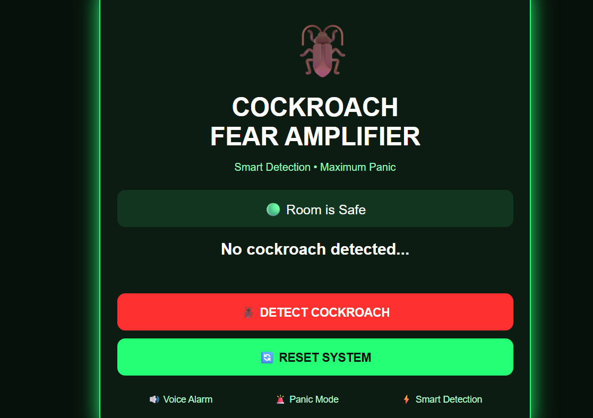

# [Project Name crockroach fear amplifier] 🎯

## Basic Details
### Team Name: [byteforce]

### Team Members
- Team Lead: [Ahammed shinan m] - [emea]
- Member 2: [Name] - [College]
- Member 3: [Name] - [College]

### Project Description
[is a fun and useless smart project designed to detect a crockroach and create a funny response]

### The Problem (that doesn't exist)
[What ridiculous problem are you solving?]

### The Solution (that nobody asked for)
[How are you solving it? Keep it fun!]

## Technical Details
### Technologies/Components Used
For Software:
- [Language used html,css,java script]
- [Frameworks used]none
- [Libraries used]web speech api
- [Tools used] vscode,github,web browser

For Hardware:
- [List main components]esp32,ir sensor,ultrasonic sesor,led,speaker
- [List specifications]
- [List tools required]jumper wire,breadboard,usb cable

### Implementation
For Software:
# Installation
[commands]

# Run
[commands]

### Project Documentation
For Software:

# Screenshots (Add at least 3)

One Cockroach Detected. Maximum Panic Activated. 🪳🚨🔊

**Cockroach detected… 💀🪳 Panic mode: ACTIVATED! 🚨🔊**

# Diagrams
Workflow: The system captures the environment through the camera → uses AI-based object detection to identify a cockroach → triggers the detection alert → activates Panic Mode with a voice alarm and visual effects → allows the user to reset the system and scan again. 🪳🚨🔊

Detect → Analyze → Alert → Panic Mode → Reset — a smart system designed to turn cockroach detection into maximum panic.” 🪳⚡
